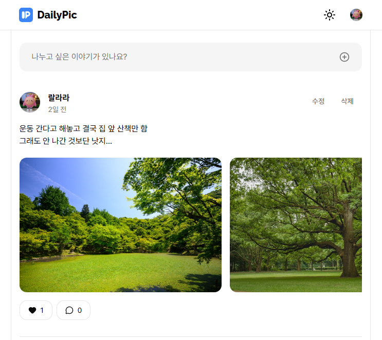

# DailyPic

React + TypeScript + Vite 기반으로 제작한 일상 기록 서비스입니다.
기존 학습 프로젝트를 기반으로 UI와 기능을 개선하고,  
상태 관리 및 데이터 처리 구조를 리팩토링하여 포트폴리오용으로 재구성했습니다.

---

## 프로젝트 소개

해당 프로젝트는 인프런의  
: <a
href="https://www.inflearn.com/course/%ED%95%9C-%EC%9E%85-%ED%81%AC%EA%B8%B0%EB%A1%9C-%EC%9E%98%EB%9D%BC%EB%A8%B9%EB%8A%94-%EC%8B%A4%EC%A0%84-%ED%94%84%EB%A1%9C%EC%A0%9D%ED%8A%B8/dashboard?cid=336312"
target="\_blank"
rel="noopener noreferrer"

> 한 입 크기로 잘라 먹는 실전 프로젝트 강의
> </a>
> 를 참고하여 제작하였습니다.

기존 학습 프로젝트를 그대로 사용하는 대신,  
실제 서비스 형태를 고려하여 기능과 구조를 직접 개선했습니다.

---

## 개선 사항

- 서비스 로고 및 브랜딩 수정
- 일부 기능 오류 수정 및 안정성 개선
- 접근성(Accessibility) 개선
- 댓글 기능 개선
  - 기존 단순 링크 이동 방식 수정
  - 댓글 작성 시 댓글 수가 실시간으로 반영되도록 변경
- Supabase 기반 데이터 관리 구조 적용
- Zustand를 활용한 전역 상태 관리 적용
- TanStack Query를 활용한 서버 상태 관리 및 캐싱 처리

---

## Features

- 로그인 / 회원가입
- 게시글 CRUD
- 댓글 기능
- 실시간 댓글 수 반영
- 반응형 UI
- 다크모드

---

## Tech Stack

### Frontend

- React
- JavaScript
- React Router
- CSS Modules

### State Management

- Zustand
- TanStack Query

### Backend / Database

- Supabase

---

## Preview

### Home



### Deploy

<a
href="https://onebite-log-lake.vercel.app/"
target="\_blank"
rel="noopener noreferrer"

> https://onebite-log-lake.vercel.app/
> </a>

---

## Getting Started

```bash
npm install
npm run dev
```
